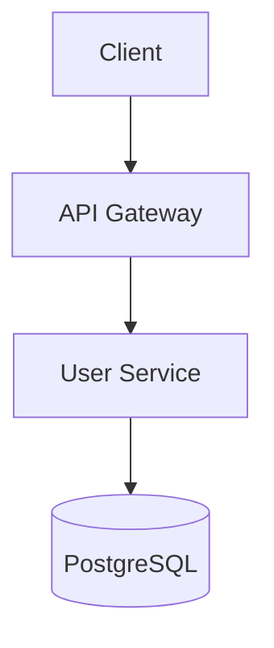

# Law: documentation-best-practices

**Severity:** warn  
**Created:** 2026-04-25T00:00:00Z  
**Category:** Documentation

## Purpose

Enforces documentation best practices for APIs, architecture decisions, and operational guides.

## Reference Materials

### Primary Sources

1. **Swagger/OpenAPI - Best Practices in API Documentation**  
   https://swagger.io/resources/articles/best-practices-in-api-documentation/  
   Industry standard for REST API documentation, including examples, schemas, and operation descriptions.

2. **ADR GitHub Organization**  
   https://adr.github.io/  
   Architecture Decision Records community site with templates, tools, and MADR format.

3. **Michael Nygard - Documenting Architecture Decisions**  
   https://cognitect.com/blog/2011/11/15/documenting-architecture-decisions  
   The original article introducing ADRs. Explains why context matters more than decisions.

4. **Keep a Changelog**  
   https://keepachangelog.com/en/1.0.0/  
   Standard format for changelogs. Human-readable, machine-parseable.

5. **PagerDuty - Incident Response Runbook Guide**  
   https://www.pagerduty.com/resources/learn/incident-response-runbook/  
   Best practices for operational documentation and incident response procedures.

6. **GitLab Documentation Guidelines**  
   https://docs.gitlab.com/ee/development/documentation/  
   Enterprise-grade technical writing standards and docs-as-code practices.

## Patterns Checked

### 1. README Required
From [GitLab Docs](https://docs.gitlab.com/ee/development/documentation/):
> "Every project must have a README with title, description, installation, and usage."

```
Every project root must contain README.md with:
- Title and one-line description
- Installation instructions
- Usage examples
- Contributing guidelines (if open source)
- License
```

### 2. API Documentation Standards
From [Swagger Best Practices](https://swagger.io/resources/articles/best-practices-in-api-documentation/):
> "Include examples for every operation. Describe error responses. Document all parameters."

```yaml
openapi: 3.0.0
info:
  title: Users API
  description: |
    Multi-line description with **Markdown**.
    - Lists are supported
    - Formatting matters
  version: 1.0.0

paths:
  /users:
    get:
      summary: List all users
      description: Returns paginated list of users
      parameters:
        - name: page
          in: query
          description: Page number (1-based)
          schema:
            type: integer
            default: 1
      responses:
        200:
          description: Successful response
          content:
            application/json:
              schema:
                $ref: '#/components/schemas/UserList'
              example:
                data:
                  - id: "usr_123"
                    name: "John Doe"
```

### 3. Architecture Decision Records (ADRs)
From [Nygard's ADR Article](https://cognitect.com/blog/2011/11/15/documenting-architecture-decisions):
> "ADRs capture context, decision, and consequences. Context is the most important part."

```markdown
# ADR 001: Use PostgreSQL for Primary Database

## Status
- Proposed
- Accepted (2024-01-15)
- Deprecated by ADR 012

## Context
We need a relational database for user data...

## Decision
We will use PostgreSQL 15...

## Consequences
- Positive: ACID compliance, rich ecosystem
- Negative: Operational complexity vs SQLite

## Alternatives Considered
- MySQL: Rejected due to licensing concerns
- SQLite: Rejected - doesn't scale horizontally
```

### 4. Code Comments Are Last Resort
From [Clean Code by Robert Martin](https://www.oreilly.com/library/view/clean-code/9780136083238/):
> "Comments are a failure to express intent in code. Prefer self-documenting code."

```javascript
// Bad: Comment repeats code
// Increment counter
counter++;

// Good: Comment explains WHY
// Compensation for off-by-one error in legacy API
counter++;

// Better: Self-documenting code
const LEGACY_API_OFFSET = 1;
adjustedCount = rawCount + LEGACY_API_OFFSET;
```

### 5. Function Documentation (JSDoc/Docstring)
From [Google JavaScript Style Guide](https://google.github.io/styleguide/jsguide.html#jsdoc):

```javascript
/**
 * Calculates discounted price based on user tier.
 * @param {number} basePrice - Original price in USD
 * @param {string} userTier - 'basic', 'premium', 'enterprise'
 * @param {Date} [saleDate] - Optional date for seasonal discounts
 * @returns {number} Final price after discounts
 * @throws {InvalidTierError} When userTier is not recognized
 * @example
 * const price = calculateDiscount(100, 'premium');
 * // returns 85
 */
function calculateDiscount(basePrice, userTier, saleDate) {
  // Implementation
}
```

### 6. Changelog Format (Keep a Changelog)
From [keepachangelog.com](https://keepachangelog.com/en/1.0.0/):

```markdown
# Changelog

All notable changes will be documented here.

## [Unreleased]

### Added
- New feature X

### Changed
- Updated dependency Y to v2.0

### Deprecated
- Feature Z is now deprecated

### Removed
- Dropped support for Node 14

### Fixed
- Bug in authentication flow

### Security
- Patched vulnerability in dependency

## [1.2.0] - 2024-01-15
### Added
- User profile endpoint
```

### 7. Runbook Template
From [PagerDuty Runbook Guide](https://www.pagerduty.com/resources/learn/incident-response-runbook/):

```markdown
# RUNBOOK: Database Connection Failures

## Symptoms
- Alert: `database_connection_errors > 0`
- User reports: "Application is down"
- Dashboard: Database latency spike

## Impact
- Users cannot log in
- New data not persisted
- Read operations may still work (cached)

## Detection
```promql
increase(database_connection_errors_total[5m]) > 0
```

## Resolution Steps
1. Check RDS status in AWS console
2. Verify security group hasn't changed
3. Try connecting from bastion host
4. If fails from bastion: escalate to DBA
5. If bastion works: check app credentials

## Rollback
- No rollback possible - data loss if transactions fail

## Post-Incident
- [ ] Add connection pool monitoring
```

### 8. No Orphaned Documentation
From [GitLab Docs](https://docs.gitlab.com/ee/development/documentation/):
> "Docs must be updated with code changes. PR checklists should include documentation."

```
PR checklist:
- [ ] API documentation updated
- [ ] README updated if public interface changed
- [ ] Changelog entry added
```

### 9. Diagrams as Code
From [Mermaid Documentation](https://mermaid.js.org/):
> "Store diagrams as code for version control and easy updates."

```
# Bad: Binary image in repo
architecture.png  # Gets stale, can't diff

# Good: Mermaid diagram
architecture.mmd:

```

### 10. Inline TODO Format
From [GitLab Docs](https://docs.gitlab.com/ee/development/documentation/):
> "TODOs must reference tickets for traceability."

```javascript
// Good: TODO with ticket reference
// TODO(#123): Handle edge case when user has no orders
// See: https://github.com/org/repo/issues/123

// Bad: TODO without context
// TODO: fix this
```

## Remediation

Documentation debt compounds faster than code debt. Review against patterns above to maintain project knowledge.

---

*Guidance synthesized from OpenAPI, ADR, and Keep a Changelog standards.*
